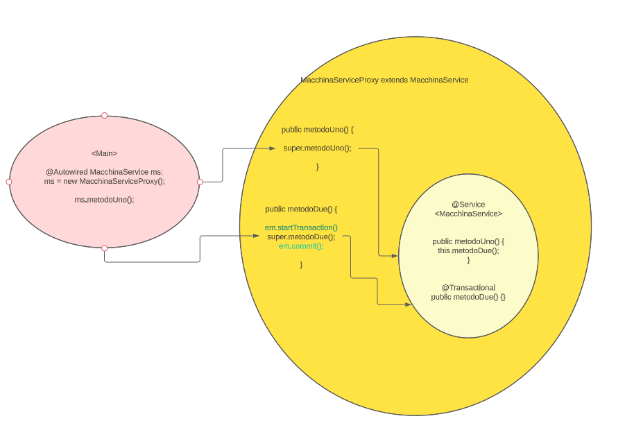

= Proxy dei bean

//TODO
Chiamare i metodi transazionali dei bean da fuori, altrimenti
 se dall'interno del bean in un metodo non transazionale, viene chiamato
un metodo annotato con @Transactional in realtà non si sta chiamando il metodo avvolto
dal proxy.

quindi: dal main che contiene il proxy del bean si deve chiamare metodoUno
poi metodoDue. in questo modo si passa ogni volta dal proxy che avvolge il bean
ed i metodi.