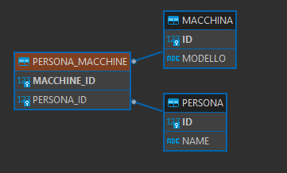
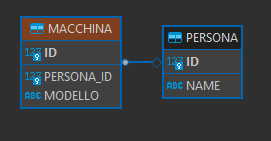

:icons: font
= OneToMany

[IMPORTANT]
====
.Associazione a titolo di esempio
Testo della nota
====

[NOTE]
====
.Mappatura corretta
Per una corretta associazione vedere il package "bidirezionale_one_to_many"
====

== Unidirezionale

[,java]
----
@Entity
@NoArgsConstructor
@Getter
@Setter
public class Persona {

  @Id
  @GeneratedValue(strategy = GenerationType.IDENTITY)
  private Long id;

  private String name;

  @OneToMany(cascade = CascadeType.ALL, orphanRemoval = true)
   private Set<Macchina> macchine = new HashSet<>();

  /**
   * Evitare di usare le liste, perchè questo genere una quantita di insert nel momento della rimozione di un elemento dalla lista.
   * Questo perchè essendo le liste ordinate, quando rimuovi un elemento lui si deve riordinare la lista come in precedenza
   * hibernate vede questo come una modifica e quindi elimina tutti gli elementi e li reinserisce.
   */
  //  private List<Macchina> macchine = new ArrayList<>();
}
----

[,java]
----
@Entity
@NoArgsConstructor
@Getter
@Setter
public class Macchina {

  @Id
  @GeneratedValue(strategy = GenerationType.IDENTITY)
  private Long id;

  private String modello;
}
----

* Questo mappatura genera una tabella di mezzo PERSONA_MACCHINE con Persona_id e Macchina_id

****
Per un DBA, questa assomiglia più a un'associazione di database molti-a-molti che a una relazione uno-a-molti e non è neanche molto efficiente.
Invece di due tabelle, ora ne abbiamo tre, quindi utilizziamo più spazio di archiviazione del necessario.
Invece di una sola chiave esterna, ora ne abbiamo due.
Tuttavia, poiché molto probabilmente indicizzeremo queste chiavi esterne, avremo bisogno del doppio della memoria per memorizzare nella cache l'indice per questa associazione.
Non bello!
****

* Questo metodo viene utilizzato per creare una persona e per associargli una macchinaBi

[,java]
----
public void inizializzaPersonaConUnaMacchinaAssociata() {

    log.info(() -> "Inizializzo il db con la creazione di una persona con una macchinaBi associata");

   Persona stefano = new Persona();
    stefano.setName("Stefano");

    Macchina ford = new Macchina();
    ford.setModello("ford");

    Macchina bmw = new Macchina();
    bmw.setModello("bmw");

    stefano.getMacchine().add(ford);
    stefano.getMacchine().add(bmw);

    personaRepository.save(stefano);

    log.info(()-> "Fine inizializzazione");
  }
----

* Con questa mappatura vengono effettuate queste query di inserimento:

[,sql]
----
insert into persona (name,id) values (?,default)
insert into macchina (modello,id) values (?,default)
insert into macchina (modello,id) values (?,default)

insert into persona_macchine (persona_id,macchine_id) values (?,?)
insert into persona_macchine (persona_id,macchine_id) values (?,?)
----
* Con questa mappatura vengono effettuate queste query per rimuovere una macchina da un proprietario:

[,sql]
----
select m1_0.persona_id,m1_1.id,m1_1.modello from persona_macchine m1_0 join macchina m1_1 on m1_1.id=m1_0.macchine_id where m1_0.persona_id=?
delete from persona_macchine where persona_id=?
insert into persona_macchine (persona_id,macchine_id) values (?,?)
----

[IMPORTANT]
====
.Mappatura con Persone che contiene una Lista di macchine:
. Viene fatta una delete sulla tabella PERSONA_MACCHINE per tutti gli elementi che contengono l'id della persona a cui vogliamo rimuovere una singola macchina.
questo significa che togli in prima battuta tutte le associazini tra quell'utente e le auto.
. Poi fa la insert per riassociare le auto rimaste a quella persona.

Questo avviene perche Persona ha al suo interno una lista di Macchina, la lista deve mantenere l'ordine e per questo
vengono rimosse e reinserite nello stesso ordine.

QUINDI ---> utilizzare i SET

Set<Macchina>

====

Utilizzando i Set ecco le query che vengono generate:

[,sql]
----
select p1_0.id,p1_0.name from persona p1_0
select m1_0.persona_id,m1_1.id,m1_1.modello from persona_macchine m1_0 join macchina m1_1 on m1_1.id=m1_0.macchine_id where m1_0.persona_id=?
delete from persona_macchine where persona_id=? and macchine_id=?
----
Viene effettuta la delete puntuale dell'elemento.

== Con JoinColumn

[,java]
----
@Entity
@NoArgsConstructor
@Getter
@Setter
public class Persona {

  @Id
  @GeneratedValue(strategy = GenerationType.IDENTITY)
  private Long id;

  private String name;

  @OneToMany(cascade = CascadeType.ALL, orphanRemoval = true)

  // Aggiunta questa annotazione
  @JoinColumn(name = "persona_id")
  private List<Macchina> macchine = new ArrayList<>();
}
----

[,java]
----
@Entity
@NoArgsConstructor
@Getter
@Setter
public class Macchina {

  @Id
  @GeneratedValue(strategy = GenerationType.IDENTITY)
  private Long id;

  private String modello;
}
----

* L' @JoinColumn annotazione aiuta Hibernate a capire che PERSONA_ID nella tabella MACCHINE
è presente una colonna Foreign Key che definisce questa associazione.

* Con questa mappatura vengono effettuate queste query:
questa volta inseriamo due macchine.

[,sql]
----
insert into persona (name,id) values (?,default)
insert into macchinaBi (modello,id) values (?,default)
insert into macchinaBi (modello,id) values (?,default)
update macchinaBi set persona_id=? where id=?
update macchinaBi set persona_id=? where id=?
----

Come possiamo vedere vengono effettuate 3 insert, 1 per la persona e 2 per le macchine,
poi ogni macchinaBi viene fatto l'update per assegnargli la persona.

