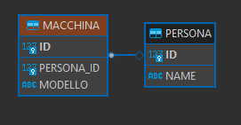

:icons: font
= OneToMany

[IMPORTANT]
====
.Associazione a titolo di esempio
Testo della nota
====

[NOTE]
====
.Mappatura corretta
Per una corretta associazione vedere il package "bidirezionale_one_to_many"
====

== Unidirezionale

[,java]
----
@Entity
@NoArgsConstructor
@Getter
@Setter
public class Persona {

  @Id
  @GeneratedValue(strategy = GenerationType.IDENTITY)
  private Long id;

  private String name;

  @OneToMany(cascade = CascadeType.ALL, orphanRemoval = true)
  private List<Macchina> macchine = new ArrayList<>();
}
----

[,java]
----
@Entity
@NoArgsConstructor
@Getter
@Setter
public class Macchina {

  @Id
  @GeneratedValue(strategy = GenerationType.IDENTITY)
  private Long id;

  private String modello;
}
----

* Questo mappatura genera una tabella di mezzo PERSONA_MACCHINE con Persona_id e Macchina_id
image:risorse/img.png[]

****
Per un DBA, questa assomiglia più a un'associazione di database molti-a-molti che a una relazione uno-a-molti e non è neanche molto efficiente.
Invece di due tabelle, ora ne abbiamo tre, quindi utilizziamo più spazio di archiviazione del necessario.
Invece di una sola chiave esterna, ora ne abbiamo due.
Tuttavia, poiché molto probabilmente indicizzeremo queste chiavi esterne, avremo bisogno del doppio della memoria per memorizzare nella cache l'indice per questa associazione.
Non bello!
****

* Questo metodo viene utilizzato per creare una persona e per associargli una macchinaBi

[,java]
----
public void inizializzaPersonaConUnaMacchinaAssociata() {

    log.info(() -> "Inizializzo il db con la creazione di una persona con una macchinaBi associata");

    Persona stefano = new Persona();
    stefano.setName("Stefano");

    Macchina macchinaBi = new Macchina();
    macchinaBi.setModello("ford");

    stefano.getMacchine().add(macchinaBi);

    personaRepository.save(stefano);

    log.info(()-> "Fine inizializzazione");
  }
----

* Con questa mappatura vengono effettuate queste query:

[,sql]
----
insert into persona (name,id) values (?,default)
insert into macchinaBi (modello,id) values (?,default)
insert into persona_macchine (persona_id,macchine_id) values (?,?)
----

== Con JoinColumn

[,java]
----
@Entity
@NoArgsConstructor
@Getter
@Setter
public class Persona {

  @Id
  @GeneratedValue(strategy = GenerationType.IDENTITY)
  private Long id;

  private String name;

  @OneToMany(cascade = CascadeType.ALL, orphanRemoval = true)

  // Aggiunta questa annotazione
  @JoinColumn(name = "persona_id")
  private List<Macchina> macchine = new ArrayList<>();
}
----

[,java]
----
@Entity
@NoArgsConstructor
@Getter
@Setter
public class Macchina {

  @Id
  @GeneratedValue(strategy = GenerationType.IDENTITY)
  private Long id;

  private String modello;
}
----

* L' @JoinColumn annotazione aiuta Hibernate a capire che PERSONA_ID nella tabella MACCHINE
è presente una colonna Foreign Key che definisce questa associazione.

* Con questa mappatura vengono effettuate queste query:
questa volta inseriamo due macchine.

[,sql]
----
insert into persona (name,id) values (?,default)
insert into macchinaBi (modello,id) values (?,default)
insert into macchinaBi (modello,id) values (?,default)
update macchinaBi set persona_id=? where id=?
update macchinaBi set persona_id=? where id=?
----

Come possiamo vedere vengono effettuate 3 insert, 1 per la persona e 2 per le macchine,
poi ogni macchinaBi viene fatto l'update per assegnargli la persona.

